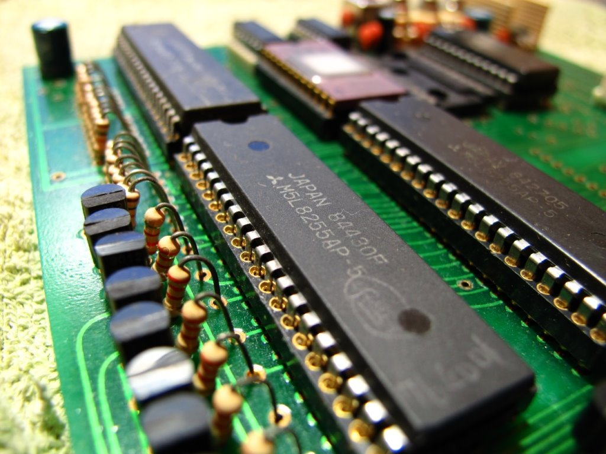

# Z80 CPU

Zilog Z80 - 維基百科，自由的百科全書
https://zh.wikipedia.org/wiki/Zilog_Z80

Zilog Z80 CPU，簡稱Z80，是一款由zilog公司製造的8位元微處理器，與英特爾公司出產的8080微處理器的指令集相容。Z80可執行為8080所寫的CP/M作業系統，所以過去在apple II相容機盛行的年代，很多人都愛在電腦內加裝z80擴充卡，並透過它來運行WordStar、VisiCalc等商業軟體。

Z80也廣泛用在一些家用電腦（當時還未使用個人電腦這一名詞）中，其中較知名的例如Tandy / Radio Shack的TRS-80。

TRS-80 Model II，
第二代的TRS-80

Game Gear遊戲機使用Zilog Z80
Z80也大量用於微電腦學習機，例如宏碁公司的第一款微電腦產品：小教授一號（MPF I）。

原始Z80的最高時脈是2.5 MHz，Z80A則可以使用到4 MHz時脈，後來推出的Z80B最高可以使用6 MHz時脈。之後還有8MHz、10MHz的版本。 Z80原使用NMOS製程，後來也有生產CMOS製程的Z80。後期使用的編號，NMOS者為Z8400，CMOS者為Z84C00。

任天堂的經典掌機GameBoy所使用的CPU——DMG，就是Z80的客製化版本。

